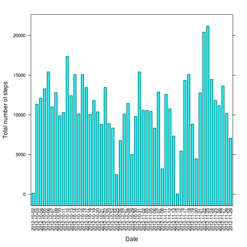
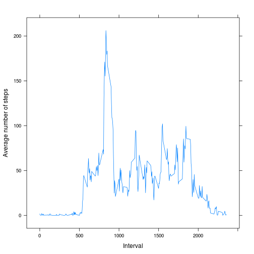
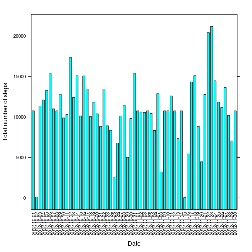
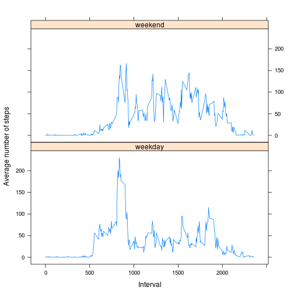

# Reproducible Research: Peer Assessment 1


## Loading and preprocessing the data
1. Load the data
    
    ```r
    destfile <- "activity.zip"
    if (!file.exists(destfile)) {
        download.file("https://d396qusza40orc.cloudfront.net/repdata%2Fdata%2Factivity.zip", 
            destfile, method = "curl")
    }
    file <- unz(destfile, unzip(destfile, list = TRUE)[1, "Name"])
    data <- read.csv(file, colClasses = c("numeric", "character", "numeric"), na.strings = "NA")
    ```

2. Convert date data into Date type
    
    ```r
    data$date <- as.Date(data$date)
    ```

## What is mean total number of steps taken per day? (Note: the missing values are ignored)
1. Make a histogram of the total number of steps taken each day
    
    ```r
    data.sum <- aggregate(steps ~ date, data, sum)
    barchart(steps ~ date, data.sum, xlab = "Date", ylab = "Total number of steps", 
        horizontal = FALSE, scales = list(x = list(rot = 90)))
    ```
    
     

2. Calculate the **mean** and **median** total number of steps taken per day
    
    ```r
    mean(data.sum$steps)
    ```
    
    ```
    ## [1] 10766
    ```
    
    ```r
    median(data.sum$steps)
    ```
    
    ```
    ## [1] 10765
    ```

## What is the average daily activity pattern? (Note: the missing values are ignored)
1. Make a time series plot of the 5-minute interval (x-axis) and the average number of steps taken, averaged across all days (y-axis)
    
    ```r
    data.mean <- aggregate(steps ~ interval, data, mean)
    xyplot(steps ~ interval, data.mean, type = "l", xlab = "Interval", ylab = "Average number of steps")
    ```
    
     

2. Which 5-minute interval, on average across all the days in the dataset, contains the maximum number of steps?
    
    ```r
    data.mean[data.mean$steps == max(data.mean$steps), "interval"]
    ```
    
    ```
    ## [1] 835
    ```

## Imputing missing values (Note: the missing values are filled in)
1. Calculate and report the total number of missing values in the dataset (i.e. the total number of rows with `NA`s)
    
    ```r
    sum(is.na(data))
    ```
    
    ```
    ## [1] 2304
    ```

2. Devise a strategy for filling in all of the missing values in the dataset.

  The mean values for 5-minute interval are used for filling in the missing values.

3. Create a new dataset that is equal to the original dataset but with the missing data filled in.
    
    ```r
    data.new <- data
    data.new[is.na(data.new)] <- rep(data.mean$steps, nrow(data.new)/nrow(data.mean))[is.na(data.new)]
    ```

4. Make a histogram of the total number of steps taken each day and Calculate and report the **mean** and **median** total number of steps taken per day. Do these values differ from the estimates from the first part of the assignment? What is the impact of imputing missing data on the estimates of the total daily number of steps?
    
    ```r
    data.new.sum <- aggregate(steps ~ date, data.new, sum)
    barchart(steps ~ date, data.new.sum, xlab = "Date", ylab = "Total number of steps", 
        horizontal = FALSE, scales = list(x = list(rot = 90)))
    ```
    
     
    
    ```r
    mean(data.new.sum$steps)
    ```
    
    ```
    ## [1] 10766
    ```
    
    ```r
    median(data.new.sum$steps)
    ```
    
    ```
    ## [1] 10766
    ```

  Dates that all the number of steps were missing are now included (e.g. *2012-10-01*, *2012-10-08*, *2012-11-01*, *2012-11-04*, *2012-11-09*, *2012-11-10*, *2012-11-14*, *2012-11-30*), and their total number of steps are the same as the mean total number of steps. As a result, the median total number of steps is now the same as the mean total number of steps.

## Are there differences in activity patterns between weekdays and weekends? (Note: the missing values are filled in)
1. Create a new factor variable in the dataset with two levels -- "weekday" and "weekend" indicating whether a given date is a weekday or weekend day.
    
    ```r
    data.new$day <- weekdays(data.new$date)
    data.new$day[!(data.new$day %in% c("Saturday", "Sunday"))] <- "weekday"
    data.new$day[data.new$day %in% c("Saturday", "Sunday")] <- "weekend"
    ```

2. Make a panel plot containing a time series plot of the 5-minute interval (x-axis) and the average number of steps taken, averaged across all weekday days or weekend days (y-axis).
    
    ```r
    data.new.mean <- aggregate(steps ~ interval + day, data.new, mean)
    xyplot(steps ~ interval | day, data.new.mean, type = "l", xlab = "Interval", 
        ylab = "Average number of steps", layout = c(1, 2))
    ```
    
     

